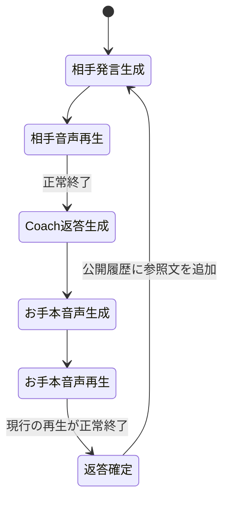

# Oral Defense Drill — アーキテクチャ

2026-09-15 / [ADR-0001](adr/0001-coach-led-shadowing.md)に基づく採用仕様。実装目標であり、現在の動作説明ではない。
2026-09-22追記: 今回のMVP範囲・実装順・レビュー後の改修時期は[実装計画](IMPLEMENTATION.md)に集約する。自由発話は製品の対象だが今回のMVP後とする。

## 1. 体験と範囲

場面と資料を選び、Coachのお手本をシャドウイングして英会話を続ける。アイスブレイク、懇親会、ゼミ議論は同じ画面のセッション設定として扱う。英語の難しさ、専門的な深さ、相手の厳しさ、補助の量を独立させる。

字幕、意味説明、返答ヒント、全文案、お手本音声・速度、録音・評価を個別調整する。字幕を隠すことと自由発話への移行は別。音声のお手本自体を使わない場合は自由発話または独立した音読練習とし、再生完了を偽装しない。

論文URL/PDF取り込みと自由発話は製品の対象。JSON Packと概要入力で標準ループを先に成立させ、段階的に追加する。独立Critic、大型チャットfork、学習済みの発音診断器は標準ループの前提にしない。

## 2. 構成と責務

既存のReact/Vite、FastAPI、SQLite、ローカル音声保存と役割別providerを流用する。UI移行は別途改造量を確認して判断する。

| 構成 | 責務と保存データ |
|---|---|
| Conversation | 場面、モード、Pack版、公開発言、返答確定元、進行状態 |
| Coach | 私的支援履歴、採用前の提案、採用する参照文の版、補助設定 |
| Audio | TTS、再生ID、録音、取得条件、transcript、参照文hash、評価状態 |
| Expert Pack | 出典、抽出本文、ページ等の位置、版、取り込み状態 |

確定会話と処理結果の正本はサーバー。再生・マイク操作はブラウザが行い、対象ID付きイベントを通知する。再生完了通知は人間が発話したことの音響的証明ではない。

## 3. シャドウイングの進行

開始後は自動で進行する。本人はお手本に重ねる・追いかける形で発話する。録音・upload・評価は別処理であり、上の遷移条件には入れない。聞いてから復唱したい場合は任意の一時停止や独立練習を利用できる。

再生前に参照文・hash・TTS設定を対応付けて保存する。複数の音声片で一つの返答を構成する場合は最終片まで正常終了した時だけ確定する。任意の編集・再生成は再生前または停止中に行い、新しい版にする。

正常終了時に `submitted_via=shadowing_playback` として参照文を一度だけ公開履歴へ追加する。本人の録音がなくても進む。次の相手音声を再生する前に任意録音を閉じ、次の音声混入を避けるが、保存や評価は待たない。

pauseでは後続の生成・再生を止め、resumeで保存済み段階から続ける。明示終了・セッション切替後の遅れたイベントで進行しない。

## 4. 自由発話と切替

相手音声終了→録音→本人の発話終了→最終文字起こし→返答確定→次の応答。停止操作を基本とし、VADによる自動終端は追加可能にする。閾値・最大録音時間は実録音で決める。発話終了で入力を閉じ、空でない最終transcriptを保存した時に公開返答が確定する。

`submitted_via=free_speech_transcript` とし、中間認識結果は送らない。通常の成功時はAccept不要。無音・空transcript・認識失敗では再録音、同じ録音の再認識、文字入力代替を提示し、お手本で代用しない。代替入力は別の由来を保存する。厳密な発音スコアは生成・表示しない。

モード変更は未確定ターンの停止中またはターン境界で行う。進行中の再生・録音を停止して旧操作IDを無効化し、確定済み履歴のモードは変更しない。

## 5. イベント・データ契約と回復

以下は新設する論理契約。HTTPパスとDB列の最終形は実装時に定める。

| イベント | 関連付け | 効果 |
|---|---|---|
| お手本再生開始 | session、turn、reference版、playback ID | 有効な再生を登録 |
| お手本再生完了 | 同じ関連付け、event/request ID | 現行の正常終了だけ返答を確定 |
| 取消・版変更 | playback ID | 旧完了通知を無効化 |
| 発話終了 | turn、recording ID、mode | 入力を閉じてASRへ |
| ASR完了 | recording ID、transcription ID | 現行の自由発話の返答を確定 |
| 評価完了 | attempt ID、reference hash | 試行へ保存。会話は進めない |

- request IDに加え、turnの一度だけの確定と次turnの一意性を保証する。同じ通知で二重進行しない。
- 完了通知に任意の英文を載せて確定させず、保存参照文をサーバーで解決。所属・モード・版を検証する。
- TTS生成・取得、相手音声、プレビュー、過去音声の再生終了では本人の返答を確定しない。
- 再生中断・失敗・拒否では未確定のまま停止し、再生操作で復帰できる。ブラウザTTSも明示選択した経路の正常終了通知を使う。
- 次の生成失敗時も確定返答を保持。再開では未完了の生成だけ再試行する。自動進行と無制限の障害再試行を区別する。
- 再読込で未通知の完了を推測しない。未確定なら再生し直し、確定済みなら次の未完了段階へ進める。
- 保存待ち録音は元turn・attemptとの関連を維持し、会話が進んでも再送できる。
- exportには参照文、実録音有無、transcript、確定元を分けて含める。既存の確定元は移行時に再生完了へ書き換えない。

## 6. コンテキストと資料

会話相手には場面設定、Pack、本人概要、確定済み公開会話のみを渡す。Coachの私的説明・未採用案・評価・録り直しを渡さない。再生完了した採用文は公開返答なので渡してよい。役割別入力builderを維持し、セッション全体を丸ごと送らない。

Coachには現在の相手発言、公開会話、資料、本人メモ、Coach履歴、補助設定を渡す。内部思考の生成・保存を要求しない。本人の結果や数値を捏造せず、不明なら未確認であることを自然に伝える返答や確認質問を作る。読み上げ用英文に未解決プレースホルダを混ぜない。

URL/PDFはユーザー指定資料を対象とし、取得・抽出失敗や未対応OCRを表示する。本文と出典位置を保持し、セッションではPack版を固定する。文書内命令をシステム指示にせず、参考論文の成果と本人の成果を区別する。検索・embedding方式は未選定。URL取得は内部ネットワークやローカルファイルの任意読み出しにならない境界を設ける。

## 7. 音声・評価

参照文は不変、録り直しは別attempt。音声取得条件とモデル版を保存する。会話の返答、参照文、録音、ASR、音響結果を分離する。

同時録音にはお手本の音が混ざり得る。混入条件を記録し、本人の単独音声とみなして採点しない。適さない音声は `insufficient_evidence` とし、希望時にお手本停止後の単独復唱録音へ移れる。既存の「録音開始でTTS停止」を同時シャドウイングへそのまま適用しない。

既知文のalignmentは時間境界、GOP等は未校正の音響指標として扱う。`unavailable`、`insufficient_evidence`、処理失敗を0点で代用しない。校正前の0–100点、確定誤音診断、ASR確信度による発音採点を出さない。自由発話のASR文を正解文として厳密な音響採点へ流さない。

[P0報告](P0_REPORT.md)の暫定工学ゲートは、devで条件固定後、別話者の無音10/10・別文18/20以上を棄却、正常読み16/20以上で有効区間生成、範囲外・逆転時刻ゼロ。同時録音混入・専門語は追加確認対象。これは診断精度の保証ではなく、実測も未完了である。

## 8. UI・継続練習・未決事項

中央に公開会話と音声操作、右またはdrawerにCoach・意味・評価、左にセッション・場面・資料を置く構成を基本案とする。標準入力はお手本、自由発話選択時はマイク。pause/resume、字幕、速度、任意反復を近くに置く。

現在の6問・Coach12往復制限を発話量の製品要件にはしない。モデル入力上限は維持し、直近公開会話、確定済み事実、出典付き背景を範囲管理して継続または次の練習区間へ移る。文脈上限・要約方式は未決。

実装状況は[実装計画の現在の実装と未達](IMPLEMENTATION.md)を参照する。概要・URL・PDF取り込みから選択本文をPackへ固定する経路と、会話停止中の単独復唱・お手本同時録音、自由発話の録音とローカルASRは接続した。実モデルでの資料利用品質、人間マイクでの音声品質・認識精度、実音響評価器は未完了。自由発話は最大30秒の手動停止とASR内のVADを使用する。文書更新だけで完成扱いにしない。

[実装計画](IMPLEMENTATION.md)と[受け入れ条件](ACCEPTANCE.md)で進捗を判定する。
